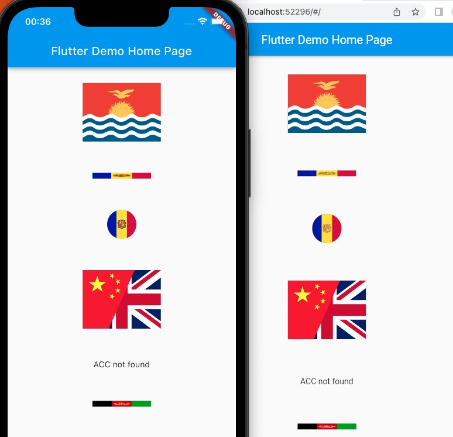

# flag
[](https://pub.dev/packages/flag)
[](https://lunagao.github.io/BlessYourCodeTag/)

A flag Flutter package for `Android` / `iOS` / `Web`. Based by [package:flutter_svg](https://github.com/flutter/packages/tree/main/third_party/packages/flutter_svg) .

## Screenshot


## Svg sources
* All flags came from https://github.com/lipis/flag-icons/releases/tag/v7.5.0

Thanks the great project [flag-icons](https://github.com/lipis/flag-icons).

## Flag list

ISO 3166-1-alpha-2 Flags

Note: 

Organisations
* `eu` European Union.

Disputed territories
* `hk` Hong Kong. Special Administrative Region of China.
* `mo` Macau. Special Administrative Region of China.
* `eh` Western Sahara. Claimed by Morocco.
* `tw` Taiwan. Claimed by China.

Undisputed territories which are non-UN state
* `va` Vatican City. Govern by the Holy See.

## How to use

```
Flag.fromCode(
    FlagsCode.COUNTRY_CODE, 
    height: HEIGHT, 
    width: WIDTH,
)
```

```
Flag.fromString(
    COUNTRY_CODE, 
    height: HEIGHT, 
    width: WIDTH,
)
```

```
Flags.fromCode(
    [
        FlagsCode.GB, 
        FlagsCode.US
    ], 
    height: 100, 
    width: 100 * 4 / 3,
)
```

Such as
* `Flag.fromCode(FlagsCode.AD, height: 100, width: null)`
* `Flag.fromString('AD', height: null, width: null)`
* `Flag.fromString('AD', height: 10, width: 100, fit: BoxFit.fill)`

## for developers
How to publish 
https://docs.flutter.dev/packages-and-plugins/developing-packages#publish

## Star History

[](https://www.star-history.com/#LunaGao/flag_flutter&Date)